# Optimal binary search tree
## Programming Assignment #2
依照PPT上的演算法，將Optimal binary search tree以Java實作出來。

Input: 
numbers from keyboard ; (You may sort them into an ordered list)

Output: 
1.	You need to output the A array that is used to store the minimum number of comparisons. 
2.	You are also required to output the optimal binary search tree on the screen.

請繳交source code 和 一份說明文件，內需含執行畫面。
無說明文件，以零分計算此作業。

### 說明
最佳化二元搜尋樹(Optimal BST)是在已知的一串序列中得到最短搜尋時間的一棵二元搜尋樹，使用動態規劃方法實作，以下分別介紹如何利用動態規劃計算二維陣列A(最佳平均時間)以及二維陣列R(二元樹根節點)，最後再將陣列R使用自定義Node建立一棵的樹並將它印出來。

### main() 函式-計算最佳二元搜尋樹
一開始要求使用者輸入每一個鍵(key)和機率(probability)兩者以空白隔開，若要結束則輸入 0。建立兩個 ArrayList 分別為 `key` 與 `value` 來儲存鍵值和興對應的機率。key和value都建立儲存完後再以key來做排序，這邊排序是以合併排序實作並採用 Recursive (遞迴)的方法。建立變數n來儲存被搜尋的機率的長度，接著分別建立大小為`[n+2][n+1]`的A和R的二維陣列，以及一個最小值min並給予一個最大值做初始值作為後面演算法比較大小的變數。

第19-25行為初始化整個二維陣列A與R，分別處理對角線初始值給予0以及`A[i][i]` 依序放入每個自己本身被搜尋的機率，24和25行是將陣列最右下角給予0(在JAVA中宣告陣列時即初始化0了，固可省略此兩行，因考慮其他程式語言列如C，故還是將20、24、25初始化為0寫上)。

第27~43行是使用動態規劃方法求出 Optimal BST 的演算法， `diagonal` 是控制斜對角線處理的位置從1開始，例如n=4時要先處理 `[1][2]`、`[2][3]`、`[3][4]` 即28行迴圈所做的事，第30行變數min為初始化變數要計算每一次中的最小值。32-34行即為算出 Pi-Pj 的加總(公式中的sigma)。35-41行是比較尋找最小搜尋值，即為左子樹加上右子樹的平均搜尋時間，比較出最小的將存入A和R的陣列中。

演算法跑完後隨即印出陣列A(最佳平均時間)與印出陣列R(二元樹根節點)，最後再依據陣列R建立一棵樹並繪製出來。

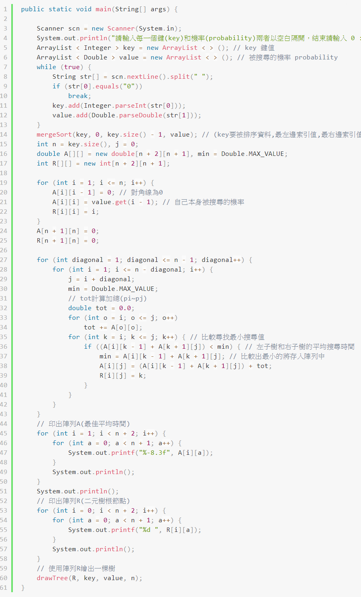

### drawTree() 函式
此函式呼叫自己所建立的 BinarySearchTree 類別建立一棵樹並走訪(前序、中序、後序)依序顯示出來，最後再用遞迴方式將樹印出來。

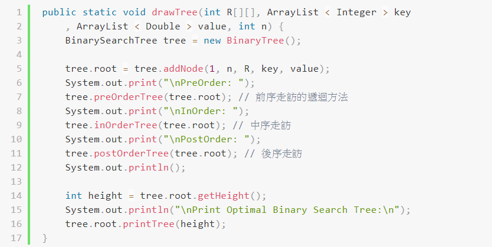

### BinarySearchTree 類別
為了程式好維護與和Optimal BST演算法區隔所以我另外寫一隻JAVA類別來處理樹，以下分別說明如何建立一個Node以及新增一個Node還有使用遞迴走訪(preOrderTree、inOrderTree、postOrderTree)及印出一棵樹。

#### Node 類別
這邊建立一個自定義的 Node 類別，分別有節點資料(key)、節點名稱(value)、左子樹(leftChild)、右子樹(rightChild)，最後並建立一個建構子，當每次新增一個 Node 時將每個變數賦予初始值。

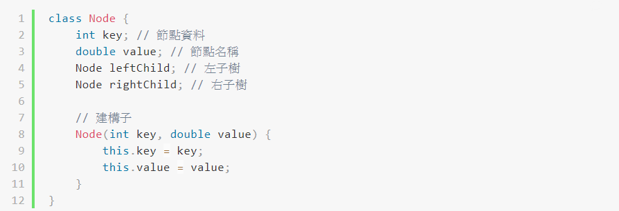

上面簡單敘述如何建立一個節點 Node，以下分別介紹 Node 類別裡的每一個方法。

`getHeight()` 方法是取得目前這一棵樹的樹高，使用遞迴方式下去計算每跑一次遞迴就加一代表目前走訪到第幾層，然後我們是要計算該樹最深的階層所以我們要在每次遞迴時去比較左子樹和右子樹哪一邊的階層數是目前最大的。

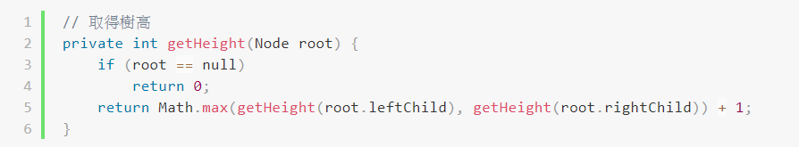

這部分要介紹印出一棵樹，第一個`printTree()`方法，我們在主程式呼叫他並給予樹的高度，接著此方法會呼叫另一個 StringBuilder 型態的 `printTree()` 方法來完整印出一棵樹，在這方法中我們要給予三個參數，第一個為數的根節點，第二個為目前的樹高，第三個為此棵樹的總高度，依序使用遞迴方式來印出完整的一棵樹，`sb` 變數為 StringBuilder 型態來儲存，`spaces` 變數是控制空白間隔的個數，首先處理最底部的樹葉，當最底部沒有樹葉時給予空白(9-16行)，當走訪到最後一層樹葉時直接印出key(15-16行)。接，第18行將目前節點 key 值塞入 sb 變數中，著處理左右斜線的輸出(17-34)判斷是否有左右子樹，若有則需印出相對應的左右斜線。37-40行分別取得目前的左子樹及右子樹內容並使用 `StringTokenizer` 字串切割分別將左右子樹分別地依據換行切開，切完之後47-58行將進行左右子樹的每一行的合併，最後並回傳結果。

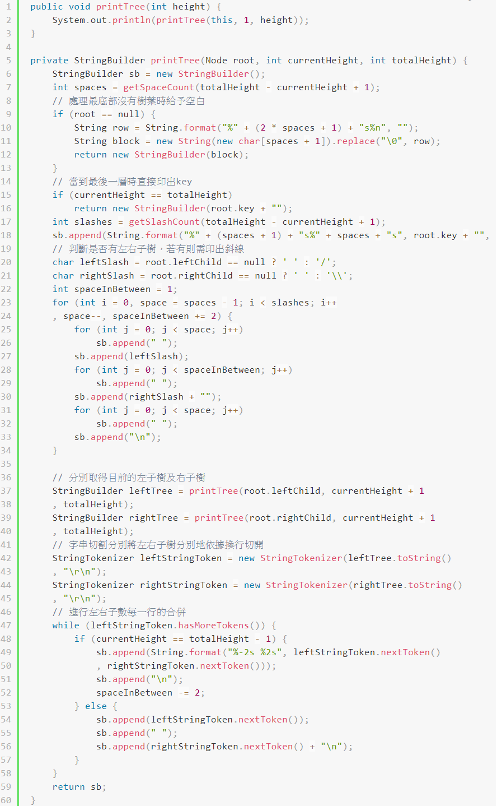

#### addNode() 新增節點
我們使用Optimal BST演算法求出來的二陣列R來建立一棵樹，第7行是建立一個新的Node，第8和9行分別使用遞迴方式建構左右子樹值到k值等於0為止。

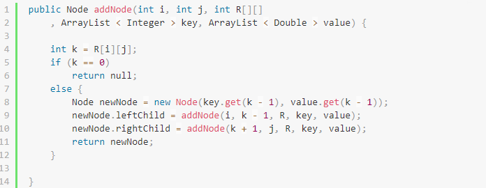

#### 樹的走訪
為了驗證我所建立的樹是正確所以分別寫出前序、中序、後序走訪來驗證。

- 前序

  前序走訪先印出節點內容，再依序使用遞迴走訪左子樹再走訪右子樹

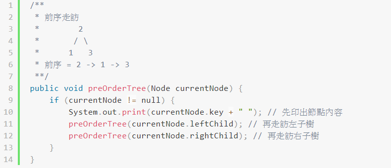

- 中序

  先遞迴走訪左子樹，再印出節點內容，最後再走訪右子樹

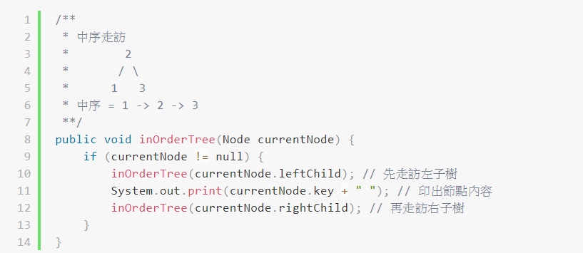

- 後序
  
  依序使用遞迴走訪左子樹再走訪右子樹，最後再印出節點內容。

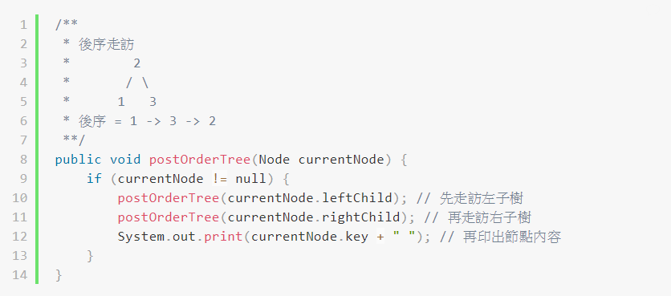

### 執行與測試

- 測試一

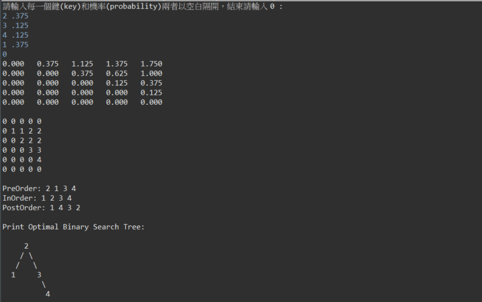

驗證:

`0.375*1+(0.375+0.125)*2+0.125*3=1.75`

- 測試二

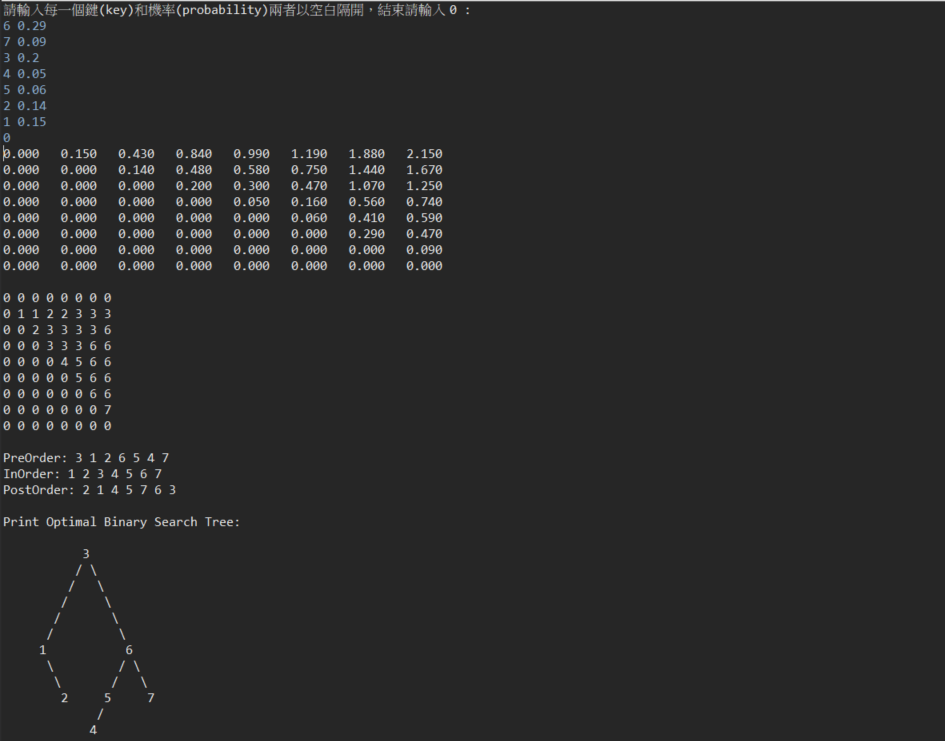

驗證:

`0.2*1+(0.15+0.29)*2+(0.14+0.06+0.09)*3+0.05*4=2.15`
